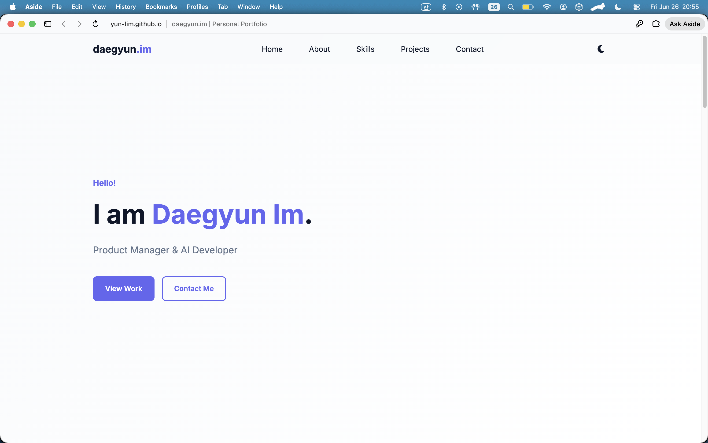
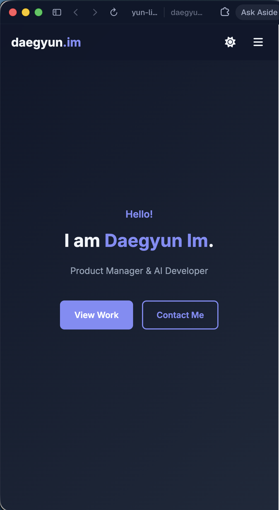
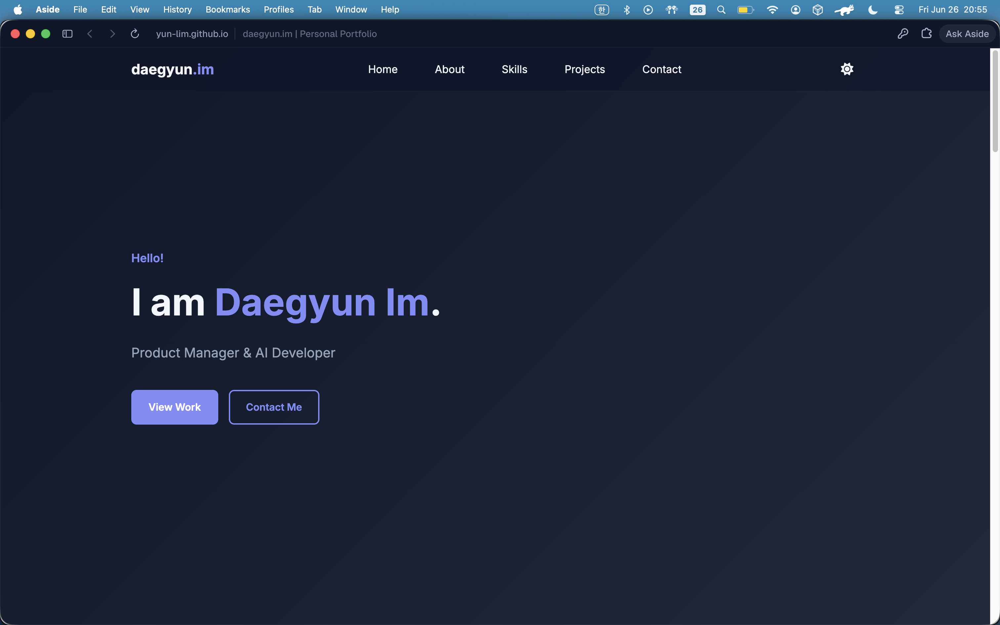

# Portfolio Website (B4-1) — daegyun.im

Daegyun Im의 개인 포트폴리오입니다. AI automation, vibe coding, Notion 워크플로우를 중심으로 한 실제 경력과 프로젝트를 담았습니다.

- **공식 사이트**: https://daegyun.im
- **연락처**: peter@thelongest.ai

## 사용 기술

- HTML5 (Semantic Markup)
- CSS3 (Flexbox, Grid, CSS Variables, Media Queries)
- JavaScript ES6+ (DOM, Events, fetch, async/await)
- GitHub REST API
- Font Awesome (아이콘)
- Google Fonts (Inter)

## 주요 기능

| 기능 | 설명 |
|------|------|
| 반응형 레이아웃 | 모바일 퍼스트, 768px / 1024px 브레이크포인트 |
| 다크 모드 | localStorage 저장, 새로고침 후 유지 |
| 햄버거 메뉴 | 모바일에서 `classList.toggle('active')` |
| 부드러운 스크롤 | 네비/CTA 클릭 시 `scrollIntoView` |
| GitHub API | 저장소 목록 동적 렌더링 (로딩/성공/에러/빈 상태) |
| 언어 필터 | `array.filter()`로 프로젝트 필터링 (보너스) |
| 폼 유효성 검사 | 이름/이메일/메시지 필수 + 이메일 형식 검증 |
| 스크롤 애니메이션 | Intersection Observer fade-in |
| Hero 타이핑 효과 | 한 글자씩 나타나는 효과 (보너스) |

## 커스텀 기준값

| 항목 | 값 |
|------|-----|
| Nav 스크롤 배경 변경 | **60px** 이상 |
| 스크롤 탑 버튼 표시 | **300px** 이상 |
| Intersection Observer threshold | **0.2** |

## 상태 → 렌더링 흐름

1. **다크 모드**: 토글 클릭 → `localStorage` + `data-theme` 변경 → CSS 변수 적용
2. **GitHub API**: `fetch` → `projectState.status` 변경 → Projects UI 재렌더링
3. **폼 검증**: `input`/`submit` → `formState` 변경 → 에러/성공 메시지 표시
4. **프로젝트 필터**: 필터 클릭 → `activeFilter` 변경 → `filter()` 후 카드 재렌더링

## 프로젝트 구조

```
portfolio/
├── index.html
├── css/style.css
├── js/
│   ├── config.js
│   ├── theme.js
│   ├── navigation.js
│   ├── projects.js
│   ├── form.js
│   └── main.js
├── images/profile.svg
├── screenshots/
│   ├── desktop.png
│   ├── mobile.png
│   └── dark-mode.png
└── README.md
```

## 로컬 실행

1. VS Code에서 `portfolio` 폴더를 엽니다.
2. Live Server 확장으로 `index.html`을 실행합니다.
3. 또는 터미널에서:

```bash
cd portfolio
python3 -m http.server 8080
# http://localhost:8080 접속
```

## GitHub API 설정

`js/config.js`에서 GitHub 사용자명을 변경할 수 있습니다.

```javascript
const CONFIG = {
  GITHUB_USERNAME: "yun-lim",
  ...
};
```

## GitHub Pages 배포

### 방법 1: 전용 저장소 (권장)

1. GitHub에 `portfolio` 저장소를 새로 만듭니다.
2. `portfolio/` 폴더 내용을 저장소 루트에 push합니다.
3. Settings → Pages → Source: `main` branch, `/ (root)`
4. 배포 URL: `https://{username}.github.io/portfolio/`

### 방법 2: gh-pages 브랜치

```bash
cd portfolio
git init
git add .
git commit -m "feat: add portfolio website"
git branch -M main
git remote add origin git@github.com:{username}/portfolio.git
git push -u origin main
```

## 배포 URL

- **GitHub 저장소**: https://github.com/yun-lim/portfolio
- **Live Site**: https://yun-lim.github.io/portfolio/

## 스크린샷

MISSION.md 제출 요구사항: 데스크톱 / 모바일 / 다크모드

### 데스크톱 (라이트 모드)



### 모바일 (반응형 + 햄버거 메뉴)



### 다크 모드



## 라이선스

MIT
